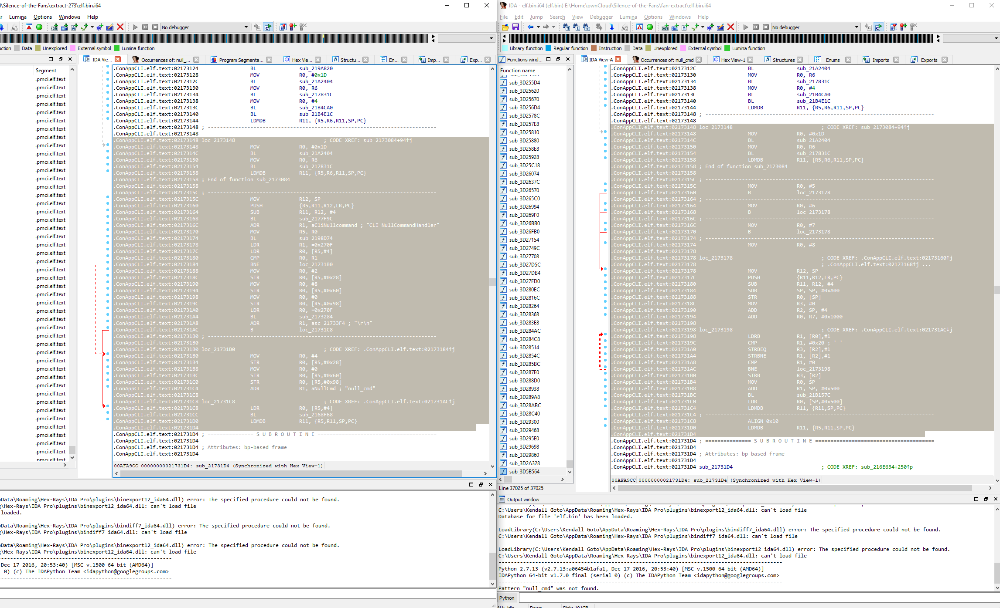

# 2022-02-16: Reproducing 2.73
I write patches to fully reproduce /u/phoenixdev's patched iLO 2.73

Once I had the original v2.73 binary and phoenixdev's, finding the differences was pretty easy. I first ran bindiff, and was mostly confused by the results. But, since we're looking at byte-sized code injections, it's a lot easier to just diff the hexdumps.

Here's a quick summary of the first things I noticed:
- We have some new code with 4 entrypoints, likely related to the 4 new functions

- We have a bunch of strings ("null_cmd", etc) that have changed values to our new functions (4 new strings)
- There's some random 4 byte words that have changed in the CLI's .data file (4 of them!)
- .health has had one function completely branched into a second function
- The second function in .health seems to replace otherwise dead code, and contains some unknown code w/ a ref to "VSPChannel"
- There's a change in the firmware update manager(? FUM) that bypasses a signature check during firmware updates

I didn't delay too much here: I took the offsets of each injection, and noted the original bytes and the new bytes. I wanted to produce v2.73 in a consistent manner first, so I took them as-is without worrying too much about changing any offsets / relative calls. I saved these patches into a JSON file for later automatic building.

## Patch System
There's a patch system built into ilo4_toolbox to allow their code injection example to work. However, it was pretty messy and not super extensible. So, I spun up a Git repo (you're on it!) and organized ilo4_toolbox's code into a submodule. Then, I rewrote their patching code into something that can take patches from a JSON file. I'm not really a python dev, but I suffered for a short script since the original was all Python.

## End of Day Products
I've fully produced a byte-for-byte replica of phoenixdev's original firmware, using explicitly patches that have been documented in patches/273/patches.md. There's still more work to be done in terms of researching each patch to replicate it on the latest iLO version, but that's for tomorrow.

Onto [Docs](2022-02-17-docs.md)!
