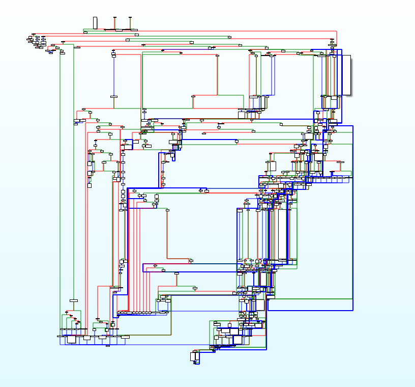

# 2022-02-18: Building v2.79
I write patches for v2.79

Before I dig into this, I looked at the changes between v2.73 and v2.79:
```
Version:2.79 (25 Nov 2021)
Java certificate for IRC shows expired.
"Mark as Repaired" button for alerts in IML UI page is greyed out.
iLO GUI doesn't show the time adjusted to the timezone.
General Exception encountered while launching Java IRC.
iLO 4 sends multiple unwanted SNMP traps with specific ID in a day.
SNTP settings couldn't be configured in the GUI with iLO 4 v2.77 and above.
iLO Events submitted by Direct Connect devices arrive in HPE backend application of Remote Support Data Center with incorrect GUIDs.

Version:2.78 (7 May 2021)
 -  Updated Jquery library to 3.5.1
 -  Updated Openssl library to OpenSSL 1.0.2x
 -  eRS enhanced to support generic service event 1000 for critical events
- IML reports fan modules failed for D3000 only after server reboot
    - eRS service event added for Critical events like System Power Fault Detection
    - Security fixes
          - Added a Content Security Policy( CSP) to harden the web interfaces
          - Enhanced Input validation for user controlled data
- Fixes for multiple security vulnerabilities

Version:2.77 (17 Dec 2020)
Added support to display login banner SSH login
Potential vulnerabilities in network stack. Click here to know more about the Security Vulnerabilities.
Active directory test may fail during LDAP authentication.

Version:2.76 (4 Nov 2020)
Users can view and modify the System thermal configuration settings using iLO interfaces.
On a server that is registered for Remote Support, if you download the Active Health System Log when Active Health System reporting information is being sent to Hewlett Packard Enterprise, the downloaded file might contain only baseline information.
The Smart Storage Battery might be listed on the System Information > Network page in the iLO web interface.

Version:2.75 (18 Aug 2020)
Potential Ripple20 vulnerabilities affecting the TCP/IP stack.

Version:2.74 (16 May 2020)
iLO 4  does not enforce the requirement for strong host keys when the Enforce AES/3DES Encryption and FIPS mode settings are enabled

 - doesn't look like anything that will burn us?
```
Actually writing the patches for v2.79 was very easy. I used my AoBs (these are best documented in patches/277/patches.md) to find each function and only had to modify offsets. None of the bytes needed to change, although that took some work to realize. (afterthought: this is actually false, we'll see that in the next page). I scanned for AoBs and replaced the functions.

I had to do some double checking to make sure command order / etc didn't change -- turns out it seems to never change between versions. I flashed the iLO with my v2.79 firmware and it was pretty good (it booted, anyway):
```
notes:
	fan didn't come down after flashing + iLO restarting
	weird fan behavior during boot sequence? fans not running during thermal testing ...
	`help` works fine on SSH, but fan command causes a stall
	stall eventually trips a watchdog and makes the iLO reset
		after reset, the web portal never comes back up but SSH does? kinda strange
	my assumption: patch on stdout redirect didn't apply correctly causing the hanging, but otherwise the firmware is ok
	validating this by removing the stdout patch entirely and testing
```
```
after removing stdout patch:
	fans come down after flashing
	all of this behavior makes a lot of sense if the internal service is calling `health` and its erroring. the controller can't get the fan speeds up during boot nor after flashing, making them awkwardly hang


	anyway - now the health service is ok and running the fans properly via iLO. however, im not getting expected output
	from my commands. i think something is wrong with the arg processor so i'll have to test that next.
```
This result was actually what prompted me to dig into the arg processing code in the last page (I'm writing this a bit out of order).

After a long day of digging around, I thought that the arg parser might be fine but the switch statement might have been shuffled. Essentially, I was calling the wrong functions in .health but otherwise parsing arguments correctly.

This was when I, with much disappointment, realized that the `fan` CLI tool (and the other health/ocsd/ocbb tools) were entirely removed from v2.79. To emphasize how much code was missing that I didn't realize, here's the graph from the fan tool that is entirely absent in v2.79:


Anyway. I moved my offsets to v2.78 and got that working -- still no dice. I liked v2.78 originally because I glanced at the included strings in the binary -- which included all the help text for the `fan` CLI tool. However, the actual code to run it is gone and the strings have no references. Oops. I loaded up v2.77 and was pleased to find the fan CLI tool in all its glory. Time to move my patches for now. Hopefully we can return to looking at v2.78+, but for now I'm getting out while I'm ahead and patching v2.77 and calling it a day.

Onto [v2.77](2022-02-19-onto-277.md)!
